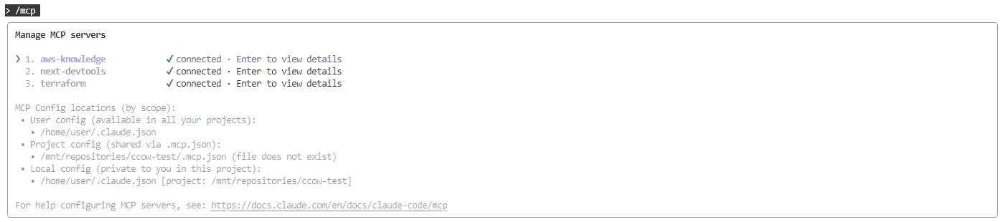

# ccow-test

This repository provides a sample project demonstrating how to use Claude Code on the Web.

## Prerequisite

### MCP Install

```
claude mcp add --transport http aws-knowledge https://knowledge-mcp.global.api.aws
claude mcp add next-devtools npx next-devtools-mcp@latest
claude mcp add terraform -s user -t stdio -- docker run -i --rm hashicorp/terraform-mcp-server
```

#### Confirm

Enter `/mcp` in Claude Code to verify.




### Codex

#### install


```
npm install -g @openai/codex
```

### Ask exec mode

```
codex exec 'Read ./specs/001-static-site-infrastructure/spec.md carefully. Audit the document and provide overall findings and concise impressions '
```

## Usage

Do not use /speckit.constitution because already created.
Do not use /speckit.clarify as possible because the plan should be fixed yourself.

### /speckit.specify

いわゆる要件定義を作成する。具体的手法、例えば技術仕様はまだ指定しない。


### /speckit.plan

いわゆる設計書を作成する。


